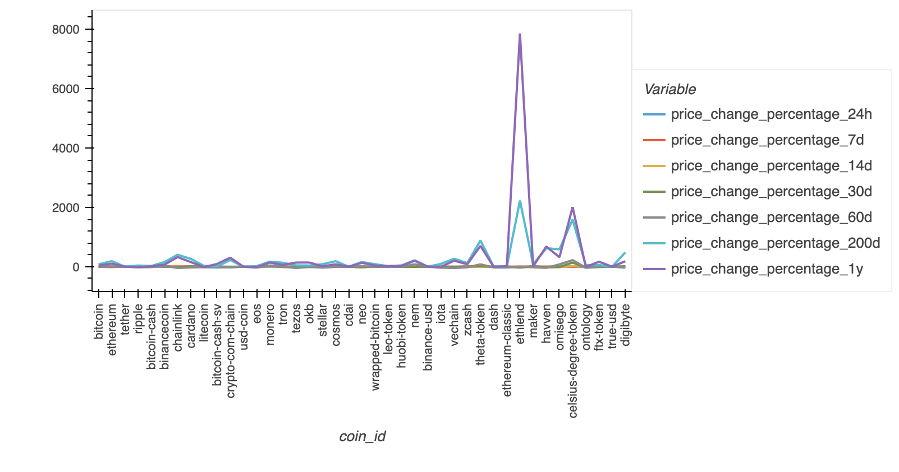
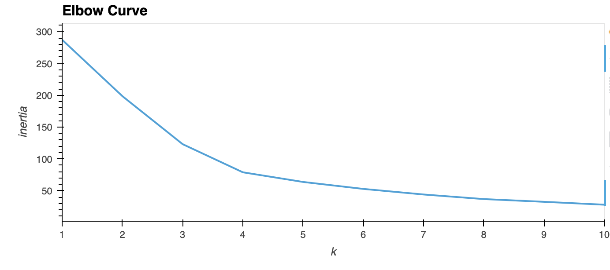
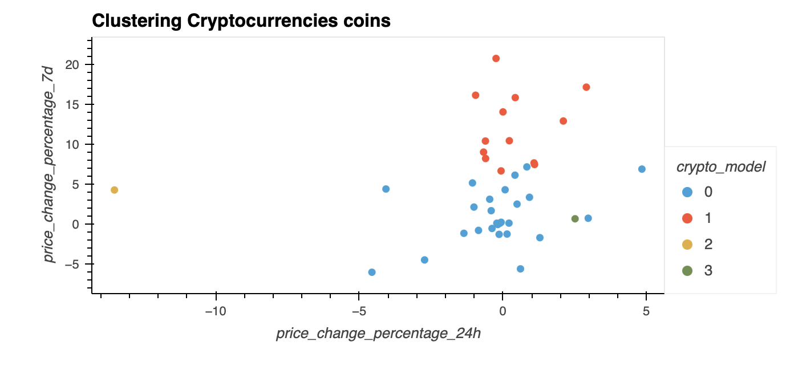
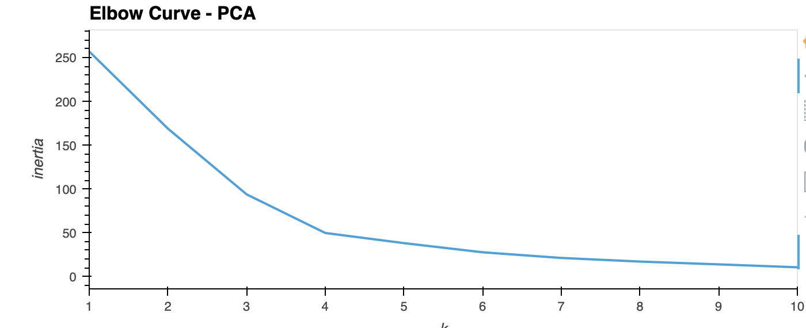
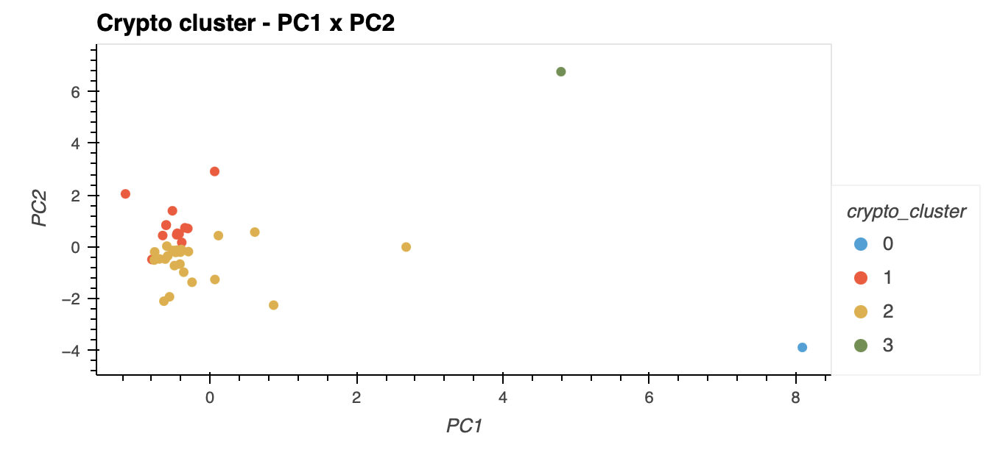
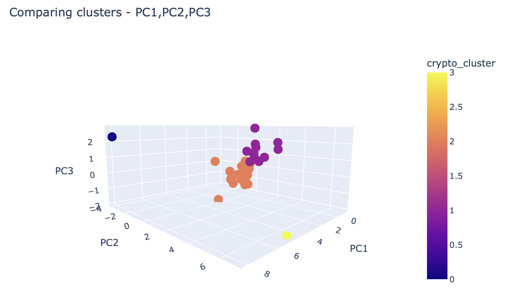

# Project Description
The following project consist of an analysis of crypto investments, where I combined Python with Unsupervised learning. Through K-Means and PCA, I examined the best values for K using PCA. 

## Packages and Requirements
In order to run the code make sure you are in the `dev` environment. To create a `dev` enviroment that runs python 3.7, go to your terminal and:
`conda create -n dev python=3.7 anaconda`
Once the enviroment is created just go to your terminal and type `conda activate dev` and to deactivate enviroment, `conda deactivate dev`.
If you have any running the code, please go to the `requirements.txt` file and make sure to install the require packages. 

# Project Analysis
I imported a crypto market data to jupyter notebook, where I could check the price percentage change in the last 24 hours, 7 days, 14 days, 30 days, 60 days, 200 days and 365 days. The following image repressents the change of each coin in the dataset. 

# Preparing the Data
Following the analysis of the dataset, I prepared the data using `StandardScaler` module to normalize the CSV file. 

# Analysing the Data
Once the data was standarlized, I then found the best value for `k`. In order to find the value, I coded the elbow algorithm method and found that the best value for k is 4. And the following is the result of that;

Once the K value was found, i fited the K-Means using the original data and predict the cluster to group of the cryptocurrencies. I then created a scatter plot to analyzie the price percentage change in the last 24 hours to the price percentage change in the last 7 days. 

# Optimizing Analysis
Created a PCA model and set it to 3 as the number of components. With the PCA set, i then tried to evaluate the best value for K using the PCA data. The result was that the best value for k was still 4. As you can see on the following graph. 

The difference from the best value for k on the original data and the PCA data. The difference was on the k value of the inertia. On the original data, the inertia has a k value = 79.022, while the PCA data has a k value with an inertia = 49.665.

I once again plotted a scatter so that I could compare the PC1 x PC2. And the following shows a very cluster of points towards the mid left of the graph. 

I went further and plotted how the 3 PCAs compared to each other, finding interesing results as you can see. 

# Conclusion
After analyzing the results, we can see quiet a bit of difference when analyzing the PCA results. Using fewer features we can see see how these clusters tend to focus more on the left/mid part of the graphic while before clustering they are more to the concentrated to the right.